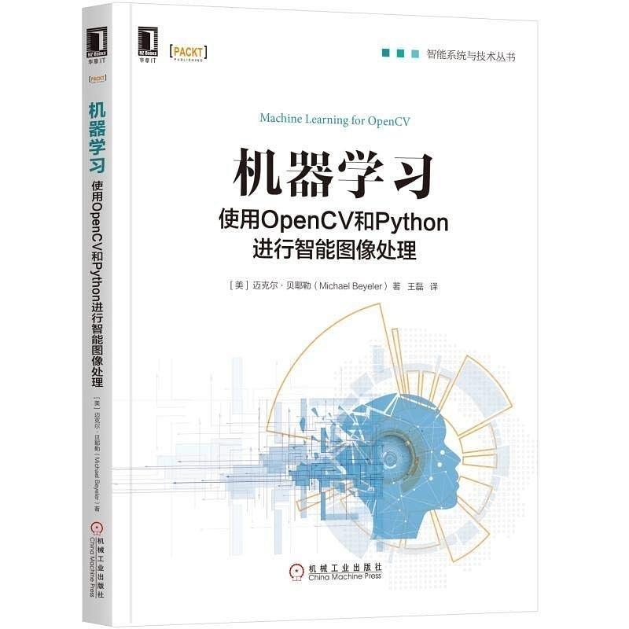

# 《机器学习-使用OpenCV和Python进行只能图像处理》
Machine Learning for OpenCV, Michael Beyeler

## 原书译本封面

### 准备
- 拷贝作者代码: `git clone https://github.com/mbeyeler/opencv-machine-learning.git`

### 环境
- python3.6
- opencv4.1

### 注意
- 由于版本问题，有些代码经过修改，与原书不同
- 原书大部分使用opencv实现，本库代码中对应的sklearn部分参考《机器学习的十大算法详细资料.pdf》
- 第9章之后用的内容，这里不做。~~相似内容见《AI工程师（计算机视觉方向）》~~