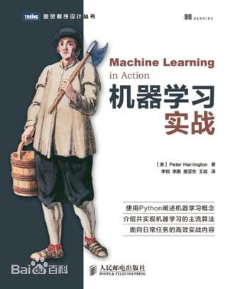

# 《机器学习实战》
- Machine Learning in Action, Peter Harrington

## cover

## 参考
- 官方代码: [>>>](https://www.manning.com/books/machine-learning-in-action)  github代码: [>>>](https://github.com/pbharrin/machinelearninginaction)
- 参考教程: [apachecn/AiLearning](https://github.com/apachecn/AiLearning)
- 参考教程: [《机器学习实战》训练营](https://github.com/RedstoneWill/MachineLearningInAction-Camp)

## 注意
- 原书代码使用python版本低于python3.5(python2.?)，部分代码有少许差异
